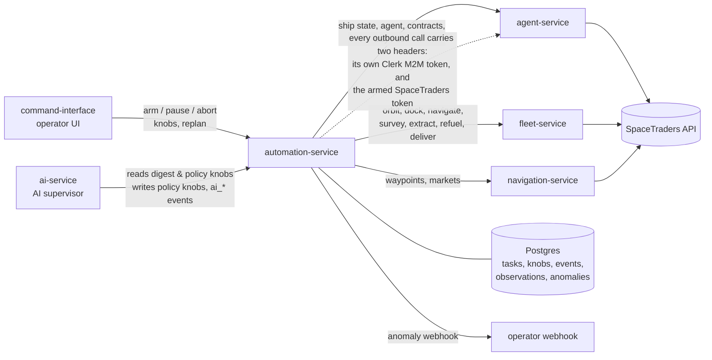
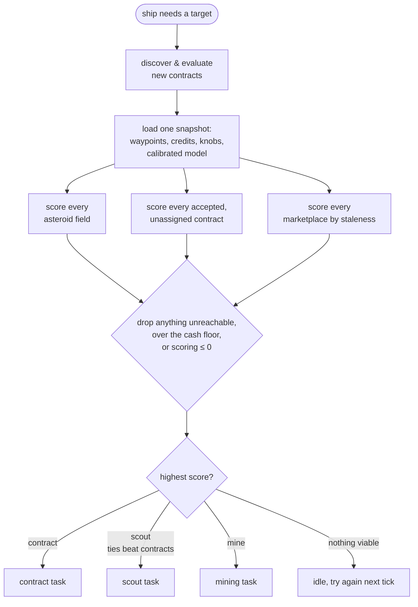
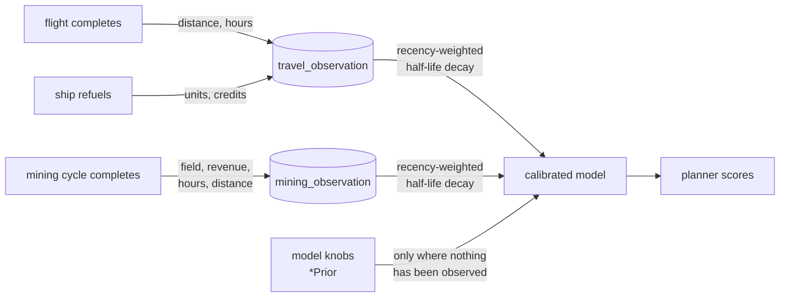
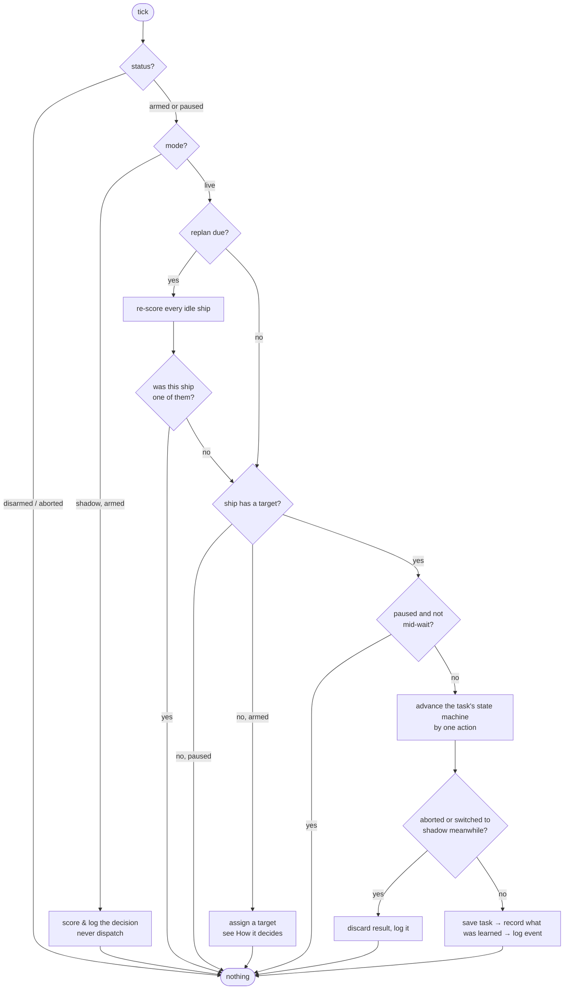
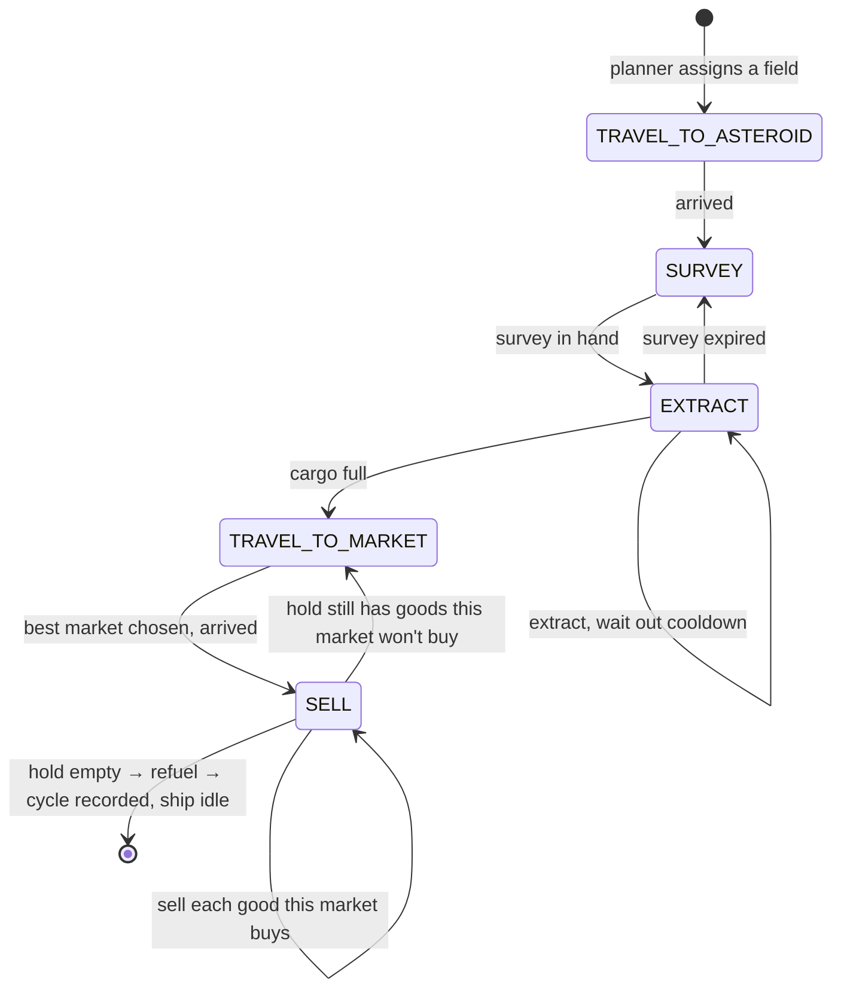
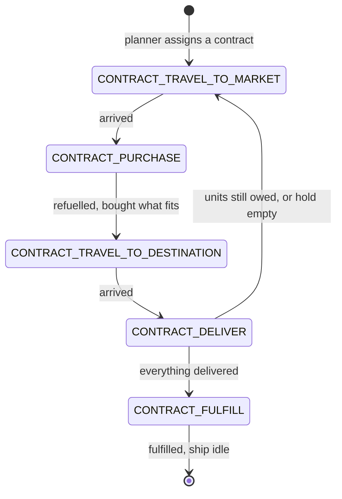
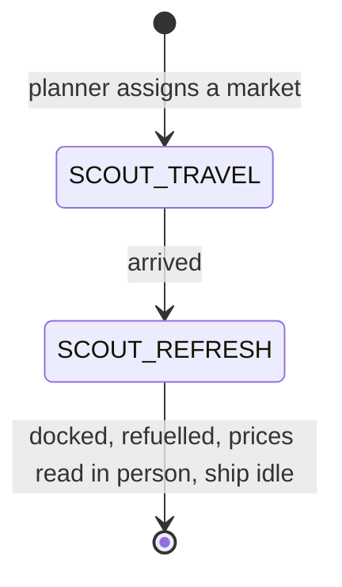
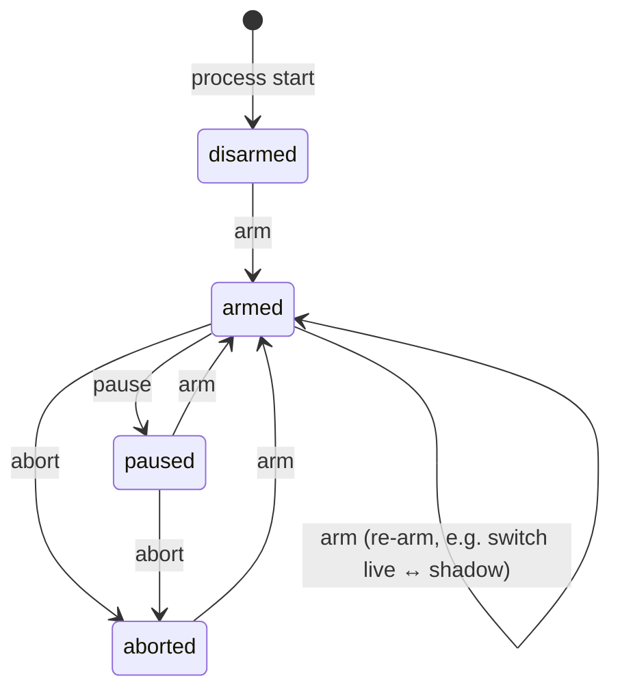
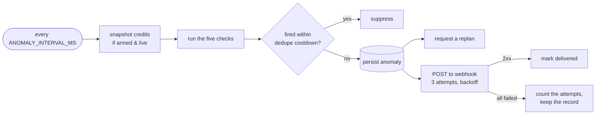

# automation-service

The autopilot. Decides what each ship should do next, drives it there, watches
for trouble, and records everything it did and why.

It never calls SpaceTraders directly. Every read and every ship action goes
through the three game-facing services, and everything it learns or decides
is written to its own Postgres.



**New here?** Read [How it decides](#how-it-decides) first. It's the part that
matters, and it's shorter than it looks. Implementation notes for contributors
and coding agents live in [CLAUDE.md](CLAUDE.md).

- [How it decides](#how-it-decides)
- [What the fleet has learned](#what-the-fleet-has-learned)
- [Knobs](#knobs)
- [The work loops](#the-work-loops)
- [Autopilot lifecycle](#autopilot-lifecycle)
- [Replan](#replan)
- [Shadow mode](#shadow-mode)
- [Watching for trouble](#watching-for-trouble)
- [Replaying decisions](#replaying-decisions)
- [API](#api)
- [Configuration](#configuration)
- [Authentication](#authentication)
- [Developing](#developing)
- [Known limitations](#known-limitations)

---

## How it decides

Three kinds of work compete for every ship: **mine** an asteroid field, **run**
a contract, **scout** a market to refresh its prices. They're compared in one
currency, **expected credits per hour**, and the highest number wins.

```
mining     score = (credits this field earns per cycle × mine weight) / cycle hours
contract   score = (expected profit × contract weight) / cycle hours
scouting   score = (credits per refresh × how stale the market is) / cycle hours

cycle hours = distance / ship speed + fixed overhead
```

That's the whole model. It lives in [`src/scoring.ts`](src/scoring.ts) as pure
functions with no I/O, which is what lets it be unit-tested directly and
re-run over history (see [Replaying decisions](#replaying-decisions)).

Three rules apply before any of it matters:

| Rule | What it means |
|---|---|
| **Nothing that earns nothing** | A score at or below zero is not a candidate. That is what makes `mine.taskWeight = 0` an off switch rather than a demotion, and what keeps a contract that can only lose money on the ground. |
| **Cash floor** | Work whose estimated cost would drop credits below `credit.reserveFloor` is removed from consideration, not scored against. If everything reachable would breach it, the ship deliberately idles. Running out of money for fuel is not recoverable in SpaceTraders, so the floor defaults to a real reserve rather than zero. |
| **Reachability** | A target the ship can't route to isn't a candidate. Routing is fuel-aware: a leg longer than the tank is impossible, and an intermediate stop must have a fuel station. |



### A worked example

A ship sits at a market. Two asteroid fields are in range:

| | distance (one way) | round trip | credits/cycle | cycle hours | score |
|---|---|---|---|---|---|
| `BELT-NEAR` | 10 | 20 | 4,200 (measured here) | 20/30 + 0.3 = **0.97** | **4,340 cr/h** |
| `BELT-FAR` | 90 | 180 | 11,800 (measured here) | 180/30 + 0.3 = **6.3** | **1,873 cr/h** |

`BELT-NEAR` wins, despite being worth less than a third as much per trip,
because it turns around six times faster. Now suppose a few more cycles at
`BELT-FAR` come back richer still, say 60,000, and its score becomes 9,524
cr/h. The planner switches, on its own, with no knob touched.

**That switch is only possible because `credits/cycle` differs per field.** If
it were one fleet-wide constant, it would cancel out of every comparison and
scoring would collapse into "always pick the nearest field". Which brings us to
the next section.

---

## What the fleet has learned

The scoring model needs four facts about the universe: what a mining cycle
earns, how fast ships fly, how long the non-flying part of a cycle takes, and
what fuel costs.

These used to be hand-typed constants. They're now **measured from the fleet's
own history**:

| Fact | Measured from | Until then |
|---|---|---|
| Credits per mining cycle, **per field** | Every completed cycle: what it sold, at which field | `mine.creditsPerCyclePrior` |
| Ship speed | Real flights: the game reports both endpoints' coordinates and both timestamps | `travel.speedUnitsPerHourPrior` |
| Fixed cycle overhead | Measured cycle time minus the travel that cycle's distance accounts for | `cycle.overheadHoursPrior` |
| Fuel credits per unit distance | Real refuel purchases: credits paid per unit bought, and a unit of fuel is a unit of distance in cruise flight | `fuel.creditsPerUnitDistancePrior` |



Older observations count for less, on a half-life set by
`observation.halfLifeHours`, so a field that has got better recently outweighs
how it behaved yesterday.

**One lucky trip does not swing an estimate**, because decay alone would not
stop it: an average over a single cycle *is* that cycle. Every field's estimate
is therefore shrunk toward the fleet average, as though it carried two extra
cycles at the fleet's typical rate. A field with one anomalously rich trip is
pulled most of the way back; a field measured four or five times is believed on
its own terms. Without that, one good survey could send the fleet to a distant
field and the only cycles able to correct the error were the ones the error
itself caused.

**Before there's data**, each falls back to its `*Prior` knob, and the planner
behaves exactly as it did before any of this existed. There's no cold-start
cliff; a brand new fleet just prefers whatever is closest until it knows better.

Every planner decision logs which numbers it used **and whether each was
measured or assumed**, so a surprising choice can be explained rather than
guessed at. `GET /planner/model` shows the current state of that:

```json
{
  "model": {
    "creditsPerCycleByWaypoint": { "X1-AB12-BELT": 4213.4 },
    "fleetCreditsPerCycle": 4213.4,
    "speedUnitsPerHour": 27.6,
    "overheadHours": 0.42,
    "fuelCreditsPerUnitDistance": 4.1,
    "provenance": {
      "creditsPerCycle": "measured", "speed": "measured",
      "overhead": "measured", "fuel": "prior",
      "miningSampleCount": 14, "flightSampleCount": 28, "refuelSampleCount": 0,
      "waypointsWithOwnAverage": ["X1-AB12-BELT"]
    }
  }
}
```

---

## Knobs

Every tunable number, with bounds, stored in Postgres and editable through the
API. Knobs come in three classes, and **the class is the point**:

| Class | What it is | Who may write it |
|---|---|---|
| **model** | A claim about how the universe behaves. Calibrated from observation; the stored value is only a cold-start prior. | Operator (to test a hypothesis). **Not the AI.** |
| **policy** | A preference with no measurable true value. | Operator **and the AI supervisor**. |

| **alert** | The threshold that decides when something is wrong. | Operator only. **Not the AI.** |

Model knobs are fenced off because editing one doesn't change reality; it
changes what the planner *believes* about reality, which is how you get a fleet
confidently flying to the wrong asteroid. Alert knobs are fenced off for a
sharper reason: an agent that can widen its own alarm thresholds will
eventually resolve "profit dropped" by deciding profit drops are fine.
`GET /planner/knobs?class=policy` is what the supervisor reads, and the filter
is applied server-side so the restriction holds even if a client forgets it.

**The fence is enforced on writes, not only on reads.** Being shown fewer
knobs is not a control: the supervisor could always have named one it wasn't
shown. `PUT /planner/knobs/:name` now checks the knob's class against the
caller, inside the same row lock as the write. A human operator authenticating
with `fleet:control` may write any class. The supervisor, authenticating as a
machine with `X-Service-Secret`, may write `policy` only and gets `403`
otherwise — so it cannot resolve "the error alarm fired" by making the error
alarm unable to fire. Either way the change lands in the event log with the
actor that made it.

### model

| Knob | Default | Meaning |
|---|---|---|
| `mine.creditsPerCyclePrior` | `5000` | Assumed revenue per mining cycle, until real cycles replace it. |
| `travel.speedUnitsPerHourPrior` | `30` | Assumed ship speed, until real flights are timed. |
| `cycle.overheadHoursPrior` | `0.3` | Assumed survey+extract+cooldown+sell time for a **mining** cycle, until real cycles replace it. |
| `cycle.transactOverheadHoursPrior` | `0.1` | Non-travel time for a task that only docks and transacts: a scout's market read, a contract's purchase or delivery. Not measured. |
| `fuel.creditsPerUnitDistancePrior` | `5` | Assumed fuel cost per unit distance, until real refuels replace it. |
| `observation.halfLifeHours` | `6` | How fast old observations stop counting. Lower adapts faster but is noisier. |

### policy

| Knob | Default | Meaning |
|---|---|---|
| `mine.taskWeight` | `1` | How much to favour mining. `0` disables it. |
| `contract.taskWeight` | `1` | How much to favour contracts, same units. `0` disables them. |
| `contract.minProfitThreshold` | `0` | Minimum expected profit to accept a contract. Raise to be pickier. |
| `scout.creditsPerRefresh` | `500` | What refreshing one market's prices is worth. `0` disables scouting. |
| `scout.stalenessThresholdHours` | `0.5` | Staleness at which a refresh is worth its full value. |
| `credit.reserveFloor` | `5000` | Cash floor the planner will never spend past. `0` switches the protection off. |
| `mine.failureRetryLimit` | `3` | Consecutive failures on a target before giving up on it. |
| `replan.debounceSeconds` | `30` | Minimum gap between replans; bursts coalesce into one. |

### alert

| Knob | Default | Meaning |
|---|---|---|
| `anomaly.shipIdleMinutes` | `10` | Minutes without progress (outside a known wait) before a ship is flagged idle. |
| `anomaly.profitDropFraction` | `0.5` | Earnings stalled if the latest rate falls below this fraction of the 6h average. |
| `anomaly.creditsFlatWindowHours` | `2` | Earnings also stalled if credits show no net increase across this window. |
| `anomaly.noEarningsMinutes` | `60` | Earnings also stalled if nothing at all sells across this window while armed or paused. |
| `anomaly.consecutiveFailureLimit` | `3` | Consecutive failures on one ship that raise an anomaly. |
| `anomaly.errorRateThreshold` | `0.1` | Error fraction of recent ship-task events — any task kind — that flags the fleet as failing. |
| `anomaly.errorRateWindowMinutes` | `5` | Window that fraction is computed over. |
| `anomaly.marketStalenessMinutes` | `30` | Minutes since a ship last read an in-use market in person before it's flagged stale. |
| `anomaly.dedupeCooldownMinutes` | `15` | How long a fired anomaly stays suppressed. |

**Scouting is priced, not switched.** `scout.creditsPerRefresh` is both the
value of a refresh and scouting's only weight. A separate weight would just
multiply against it, which is one knob pretending to be two. It can't be
measured the way mining revenue can: the cost of stale prices is the bad trades
you never see. So it's an honest policy judgment, defaulting to roughly a tenth
of a typical cycle's revenue.

**Redeploys**: bounds, defaults and classes come from the definitions in code
and are re-synced on every boot; an operator's tuned *value* survives. A knob
removed from the definitions is deleted, so no orphan lever outlives the code
that read it. A tuned value that no longer fits tightened bounds is clamped,
never left in a state the write path would reject.

---

## The work loops

Each ship runs one task at a time as a resumable state machine. Per-ship
progress persists to Postgres after every phase change, so a restart plus
re-arm resumes from the last completed phase.

Every tick performs **at most one atomic action**: dispatch one command,
resolve one elapsed wait, or get one planner assignment. Never two. That
granularity is a safety property, not an optimisation: it's what lets *pause*
take effect cleanly between actions instead of killing something mid-flight.



All three machines share their travel, docking and refuelling steps, and every
one of them **refuels at every marketplace it docks at**: the sell market, the
procurement market, the scouted market. No task hands a ship back to the
planner too dry to reach anything.

### Mining



The sell leg queries every in-system marketplace and picks the best price for
what's in the hold. A survey can yield several goods before cargo fills, so
`SELL` sells whatever the current market buys and then re-shops for a market
that takes the rest, repeating until the hold is empty. Each extra stop costs a
real trip.

On completion the ship hands itself back to the planner, and the cycle's
takings become one mining observation, which is how the next decision gets
smarter.

### Contracts



Right before every assignment decision, any contract not yet seen is discovered
and evaluated: cheapest in-system market selling the deliverable, fuel-aware
route through it to the destination, `profit = payment − procurement − travel`.
Anything clearing `contract.minProfitThreshold` is accepted on the spot.

This runs **inline, not as a background job**. An earlier version used a
background scheduler and it raced the planner: a freshly discovered,
higher-scoring contract could lose to mining purely for being mid-evaluation.
A discovery failure is logged and ignored rather than blocking mining;
contracts are additive, never a dependency.

Each trip buys as much of the contract's good as the hold has room for,
counting only that good toward what's still owed, and loops back to the market
while units remain.

### Scouting



Market prices age, and a planner deciding on stale prices decides blind.
Scouting scores "go refresh that market" against real work. A market's value
grows linearly with staleness and drops to zero the moment it's refreshed, so
the planner rotates through markets on its own; no cooldown or round-robin is
needed. A market never seen is treated as ten thresholds stale: high priority,
but finite.

**Freshness is one store**, written whenever a ship of ours reads a market
*while docked there*: a scout's refresh, or a miner pricing the market it is
about to sell at. SpaceTraders only reports trade goods to a ship that is
present, so that is the only read that actually refreshes anything; the sell
leg's comparison of every market from afar is a cache read and doesn't count.
The planner scouts against this store and the `market_stale` alert reads it
too, so a market the miner just sold at is fresh to both, and neither can call
stale what the other calls fresh.

### When a target keeps failing

After `mine.failureRetryLimit` consecutive failures the ship is reset for a
fresh assignment, **unless it's holding cargo it hasn't disposed of**, in which
case it keeps retrying rather than stranding it. An abandoned contract is
released back to the pool rather than left claimed by a ship that gave up.

---

## Autopilot lifecycle



| Status | What the scheduler does |
|---|---|
| **disarmed** | Nothing. The service has just started and nobody has armed it. |
| **armed** | Full progression: assigns targets, dispatches actions, replans. |
| **paused** | Lets an already-dispatched wait finish and be recorded, then stops dispatching. Never starts a new action or assignment. |
| **aborted** | Stops immediately. An action already in flight can't be un-sent, so its result is discarded and logged as such, not applied. |

The token only ever lives in memory, so a restart always disarms. Arming is
valid from any status, including after an abort, and is the only way to switch
between live and shadow mode.

---

## Replan

Assignment normally happens ship-by-ship as ships free up. A **replan**
re-scores every *idle* ship when something changes that could change the answer.

| Trigger | Reason logged | When it runs |
|---|---|---|
| Any knob write | `knob_change` | Once `replan.debounceSeconds` has passed since the last replan |
| Any new anomaly | `anomaly` | Same debounce |
| `POST /planner/replan` | `manual` | Same debounce |
| Periodic fallback | `interval` | `REPLAN_INTERVAL_MS` after the last replan, or after arming |

All triggers share one debounce clock, so a storm of knob changes coalesces into
a single replan.

**Running work is never preempted.** A replan only touches ships with no
assigned target. Tasks are kept short and bounded, one mining round trip or one
delivery leg, so a stale assignment costs minutes at most. Abort is the only
interrupt.

---

## Shadow mode

Arming with `mode: "shadow"` runs the full scoring cycle on the live schedule
and logs every would-be decision as `planner_shadow_assignment`, but never
writes task state and never dispatches a ship action. Nothing is ever assigned,
so the same cycle recomputes every tick: a continuous preview of what live mode
would do.

Switching between shadow and live always requires an explicit re-arm, so nobody
drifts from dry run into live dispatch by accident.

---

## Watching for trouble

Five checks run on a fixed interval, independent of whether the autopilot is
armed. A broken ship stays worth reporting while an operator investigates.

| Check | Fires when |
|---|---|
| `ship_idle` | A ship's task hasn't progressed in N minutes (while armed and live). Time inside a flight or cooldown it was told to wait out doesn't count, so a long transit never pages. |
| `earnings_stalled` | The money stopped: the hourly rate collapsed against its own history, **or** credits show no net increase across a window, **or** nothing sold at all for a window while the fleet was meant to be working. |
| `consecutive_failures` | One ship accumulates N consecutive failures. |
| `error_rate` | The error fraction of recent mining events exceeds a threshold. |
| `market_stale` | A market the sell leg priced in the last 24h hasn't been read in person by a ship within N minutes (or ever). |

`earnings_stalled` covers three readings of one problem, reported in
`detail.reasons` and separately tunable. `profit_drop` and `credits_flat` were
once separate checks; a fleet that stops earning trips both, so paging twice
made the digest look busier than the fleet was.

The third, `no_earnings`, exists because the other two compare the fleet only
against its own recent history. A fleet that has been dead long enough for
that history to reach zero has nothing left to fall below, so the alarms used
to go quiet at roughly the six-hour mark, exactly when an outage stopped being
transient. A fleet left **paused** was worse: `ship_idle` and the credit
snapshots both require armed-and-live, so nothing watched it at all.
`no_earnings` measures against zero rather than against history, and counts
paused as "meant to be working", so neither case can switch it off.



Each anomaly is **persisted before** delivery is attempted, so a webhook outage
never loses the record. Repeat firings of the same condition are suppressed for
`anomaly.dedupeCooldownMinutes` rather than paging every tick a problem stays
open.

### Metrics rollups

A background scheduler persists one rollup per tick, each covering the window
since the last one ended: credits/hour (mining sells plus both contract
payments, not netted against costs), units extracted, and error rate — the
latter over every ship-task event, not mining's alone. On restart it resumes from the last
persisted window end, so there's no gap and no double count.

---

## Replaying decisions

Every planner decision logs the inputs it used: each candidate's distance, the
calibrated model, every knob value. Since scoring is pure arithmetic over
exactly those inputs, past decisions can be re-scored under different knobs
without touching the game:

```bash
npm run replay -- --set mine.taskWeight=2
```

```bash
npm run replay -- --since 6h --set credit.reserveFloor=50000 --verbose
```

It reports how many past decisions would have gone differently. **Zero flips
means the change does nothing**, which is worth knowing before you attribute a
later swing in profit to it.

| Flag | Meaning |
|---|---|
| `--set name=value` | Override a knob (repeatable, validated against the knob's real bounds) |
| `--since 90m\|2h\|7d` | How far back to replay (default 24h) |
| `--limit N` | Cap on decisions (default 200) |
| `--verbose` | Show every candidate's score rather than only the flips |

It replays the **choice between asteroid fields**, which is where the
field-vs-field trade-off lives. It doesn't re-derive whether a contract or scout
would have beaten mining outright; those scores were frozen from market state
at the time and can't be honestly recomputed from the log.

---

## API

All routes are under `/api/automation/v1`. `/health` is unversioned.

**Autopilot**

| | |
|---|---|
| `POST /autopilot/arm` | `{ mode? }`. `mode` is `"live"` (default) or `"shadow"`. A stray `token` field from an older client is ignored. Valid from any status, including after an abort. |
| `POST /autopilot/pause` | Lets an already-dispatched wait finish and be recorded, then stops dispatching. Armed only. |
| `POST /autopilot/abort` | Stops immediately. An action already in flight can't be un-sent, so its result is discarded and marked, not silently applied. |
| `GET /autopilot/status` | Current status and mode (`mode` is `null` when disarmed or aborted). |
| `GET /autopilot/ships/:shipSymbol` | One ship's phase, wait state, and cycle progress. |
| `GET /autopilot/events?limit=` | The event log, newest first. |

**Planner**

| | |
|---|---|
| `GET /planner/knobs?class=` | Every knob, or one class. |
| `PUT /planner/knobs/:name` | `{ value }`. `404` unknown, `400` out of bounds, `403` a class this caller may not write. Logs `knob_changed` and triggers a replan. |
| `GET /planner/model` | What the planner currently believes, and whether each belief is measured or assumed. |
| `POST /planner/replan` | Requests a replan, subject to the debounce. |

**Observability**

| | |
|---|---|
| `GET /metrics/context?rollupLimit=&eventLimit=` | Rollups plus recent events in one bounded response, shaped to fit an AI context window. |
| `GET /anomalies/digest?windowMinutes=&anomalyLimit=&eventLimit=` | Anomalies plus notable events for a window: lifecycle, terminal task outcomes, silent-degradation failures, dispatch contention, knob changes and clamps, and AI actions. |
| `POST /events` | `{ type, detail }` for an external supervisor. `type` must start with `ai_`, so an external caller can log its own decisions but can never spoof a lifecycle or planner event. |

Invalid lifecycle transitions return `409` naming the current status.

---

## Configuration

| Env var | Meaning |
|---|---|
| `PORT` | Listen port (default `3003`) |
| `DATABASE_URL` | Postgres connection string (**required**) |
| `NAVIGATION_SERVICE_URL` | e.g. `http://navigation-service:8080/api/v1` (**required**) |
| `AGENT_SERVICE_URL` | e.g. `http://agent-service:80/api/agent` (**required**) |
| `FLEET_SERVICE_URL` | e.g. `http://fleet-service:3001/api/fleet` (**required**) |
| `MINING_SHIP_SYMBOL` | Ship to fly (**required**) |
| `SCHEDULER_INTERVAL_MS` | Tick cadence (default `5000`) |
| `REPLAN_INTERVAL_MS` | Periodic replan fallback (default `300000`) |
| `ANOMALY_WEBHOOK_URL` | Where to page when an anomaly fires. **Optional** — unset means anomalies are still detected, recorded and served from `/anomalies/digest`, and only the outbound POST is skipped |
| `ANOMALY_INTERVAL_MS` | Anomaly check cadence (default `60000`) |
| `METRICS_ROLLUP_INTERVAL_MS` | Rollup cadence (default `60000`) |
| `CORS_ALLOWED_ORIGIN` | Browser origin allowed to call this API (default `http://localhost:3000`) |
| `CLERK_JWT_KEY` | Clerk's RS256 public key, PEM/SPKI. Literal `\n` escapes are accepted |
| `CLERK_JWT_KEY_FILE` | Path to that key instead of an inline value; `CLERK_JWT_KEY` wins if both are set. One of the two is **required** |
| `CLERK_ISSUER` | Expected `iss`, optional. Narrows misconfiguration, not a control |
| `AI_SERVICE_SECRET` | Shared secret for `POST /events` (**required**) |
| `CLERK_M2M_SECRET_KEY` | Clerk Machine Secret Key this service mints its own outbound token with (production) |
| `DEV_M2M_SIGNING_KEY_FILE` | Path to a private key to sign that token locally instead, no Clerk account needed. One of these two is **required** |

Which asteroid field to mine is **not** configured; the planner chooses it.
Tune scoring through knobs, not env vars. Every `*_MS` value and `PORT` must
be a positive number; a malformed one refuses to start rather than turning
into a timer that fires every millisecond.

## Authentication

Every `GET` is public. Every mutating route needs a verified Clerk session
carrying the **`fleet:control`** scope, except `POST /events`, which is a machine
call from ai-service and uses the `X-Service-Secret` shared secret instead.
There is no human identity behind it, and Clerk stays scoped to humans.

| | Route | Requires |
|---|---|---|
| public | `GET /autopilot/status`, `/autopilot/events`, `/autopilot/ships/:s` | none |
| public | `GET /planner/knobs`, `/planner/model`, `/metrics/context`, `/anomalies/digest` | none |
| public | `GET /health`, `/api/automation/health` | none |
| gated | `POST /autopilot/arm`, `/pause`, `/abort` | `fleet:control` |
| gated | `POST /planner/replan` | `fleet:control` |
| gated | `PUT /planner/knobs/:name` | `fleet:control` for any class, or `X-Service-Secret` for `policy` only |
| gated | `POST /events` | `X-Service-Secret` |

Verification is **networkless**: the service holds Clerk's public key and checks
signatures itself, so there is no JWKS fetch on the hot path and no cache to go
stale. A missing token is `401`; a valid token without the scope is `403`, since
re-authenticating would not help.

`CLERK_JWT_KEY` and `AI_SERVICE_SECRET` are **required**, with no default and no
"auth optional" mode. A service that can start without a trust anchor is a
service that can be deployed with authentication silently off.

Mutating routes stamp `detail.actor`, the Clerk user id, onto the event they
write, so the audit trail records who armed, paused, aborted or retuned.

### Calling out

The sibling services gate their own routes the same way, so this service is
itself a caller that has to prove who it is. Every outbound call carries one
header:

| Header | Carries | Answers |
|---|---|---|
| `Authorization` | This service's own Clerk M2M token, minted and cached for its lifetime rather than per tick | "May automation-service act here?" |

"Which agent is this acting for?" is no longer this service's question:
st-gateway injects the fleet's agent token itself (auth-design.md decision 5).
The M2M token is also what st-gateway derives queue priority from — a machine
identity lands in the background lane, which is exactly where the autopilot
belongs (decision 2).

The M2M token comes from a real Clerk Machine in production
(`CLERK_M2M_SECRET_KEY`) and is signed locally in dev and tests
(`DEV_M2M_SIGNING_KEY_FILE`). Only the trust anchor differs; verification on
the receiving end is real either way.

---

## Developing

Tests drive the real HTTP API against a real Postgres, with stub HTTP servers
standing in for the three upstream services and an injectable clock so
multi-minute transits resolve instantly. There is no mocked database layer.

```bash
docker run --rm -d --name automation-service-test-db -p 5433:5432 \
  -e POSTGRES_PASSWORD=test -e POSTGRES_DB=automation_test postgres:16-alpine
```

```bash
npm install && npm test
```

```bash
npm run dev
```

| Command | Does |
|---|---|
| `npm test` | Full suite against the Postgres above |
| `npm run typecheck` | `tsc --noEmit` |
| `npm run build` / `npm start` | Compile to `dist/` and run |
| `npm run replay -- …` | Re-score past decisions, see [Replaying decisions](#replaying-decisions) |

How the code is laid out, the invariants each module keeps, and the testing
pitfalls to know about are in [CLAUDE.md](CLAUDE.md). Start with
[`src/scoring.ts`](src/scoring.ts) if you want to understand or change what
the autopilot optimises for.

---

## Known limitations

Everything the implementation deliberately doesn't do yet, in one place.

**Scope**

- **Single ship.** The planner, replan, and idle-ship listing are all written
  per-ship and scale to N ships without further changes, but dispatch is still
  keyed to one configured `MINING_SHIP_SYMBOL`. Nothing demonstrates fleet-wide
  fan-out.
- **One system.** Every candidate must be in the ship's current system.
- **Contracts evaluate only their first deliverable.** Multi-good contracts
  aren't supported.
- **Shadow mode doesn't discover contracts.** Accepting one is a real mutation,
  so a shadow preview scores only contracts already accepted; live mode would
  also have evaluated anything new on offer.

**Model**

- **Fuel cost is measured only from refuels that report their transaction**
  (units and price). A response without one still refuels the ship and teaches
  nothing; `fuel.creditsPerUnitDistancePrior` stands until one does. It affects
  the reserve-floor safety margin, not scoring order.
- **Fuel units are taken to equal distance**, which holds in cruise flight, the
  mode every navigate here uses. A fleet flown in burn or drift would measure
  fuel cost per unit of distance wrongly by a constant factor.
- **Routing is really a reachability check.** Every waypoint is directly
  reachable from every other and legs cost Euclidean distance, so the direct hop
  is always shortest. The search only does interesting work when the direct hop
  is out of fuel range.
- **Fuel stations are inferred** from the `MARKETPLACE` trait, without
  confirming the market actually stocks fuel. Routing and the
  refuel-at-every-market rule both lean on it: a marketplace that doesn't sell
  fuel makes the refuel there fail, which counts against the task's retry budget.
- **The mining sell leg has no route-cost awareness.** "Best market" means best
  price in the same system, not best price net of getting there.
- **A field's revenue is measured, not predicted.** The model learns what a
  field *has* paid; it doesn't model deposit types, market depth, or the price
  impact of selling into the same market repeatedly.

**Operations**

- **Metrics rollups assume a single instance.** There's no lock on them, so
  two live replicas would each bootstrap from the same window end and
  double-count. Ship *dispatch* no longer has this problem: it takes a
  Postgres advisory lock, so a second replica stands by rather than driving
  the same ship alongside the first.
- **No retention policy.** Rollups, the event log, and the two observation
  tables grow indefinitely. Observations are bounded at read time (recent rows
  only), so this is a disk concern, not a correctness one.
- **Anomalies deliver sequentially** within a tick, so several tripping at once
  against a slow webhook queue behind each other's retry budget. A delivery
  that fails every attempt is retried on later ticks, up to a bounded total,
  and then given up on.
- **A contract's expected profit stays frozen** at discovery, because it
  depends on market prices the decision has not re-read. Its cycle *time* is
  re-derived under the current model, so the half that can be kept honest is.
- **`market_stale`'s "in active use" window** is a fixed 24h lookback, not a knob.
- **Scout and contract overhead is assumed, not measured.** Both are charged
  `cycle.transactOverheadHoursPrior` rather than mining's measured residual,
  which at least stops them being billed for a survey and an extraction they
  never perform. Nothing yet calibrates their real dock-and-transact time.
- **The credits-flat half of `earnings_stalled`** reads credit snapshots that
  are only logged while armed and live, so an anomaly-only deployment with no
  `MINING_SHIP_SYMBOL` never gets them. Its `no_earnings` half is unaffected:
  it reads sell events, which are logged whenever selling happens.
- **A raised `credit.reserveFloor` default only reaches new deployments.** A
  knob's tuned value survives a redeploy by design, and an existing row sitting
  at the old default of `0` is indistinguishable from one an operator set to
  `0` deliberately. Existing deployments need the floor set once, by hand.
- **Arm/pause/abort mutate in-memory status before persisting the event**, so a
  failed event write can briefly leave status and audit trail diverged.
- **The token lives in memory only** and is never persisted, so a restart always
  disarms. A dedicated auth-service is a known future step.

See [CHANGELOG.md](CHANGELOG.md) for how this service got here, and which
`meta` issue introduced each piece.
